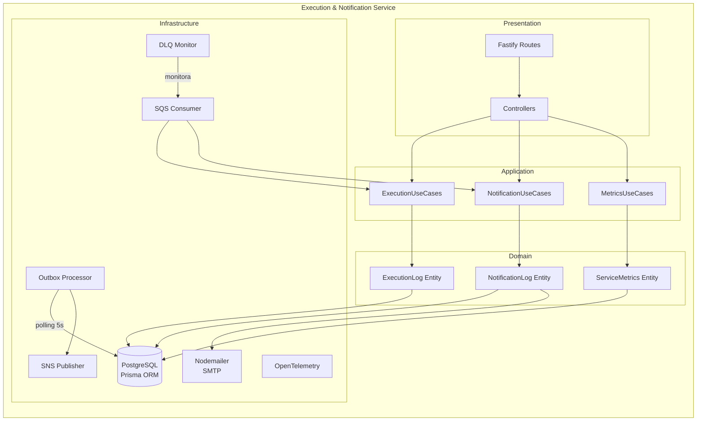
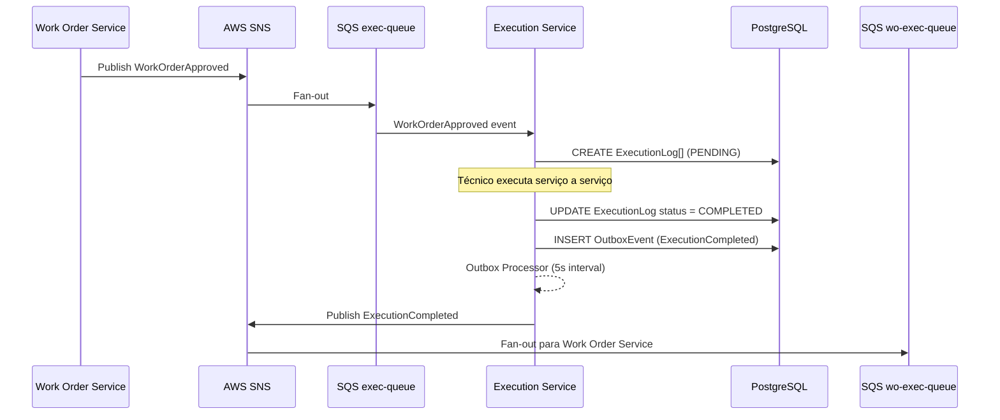
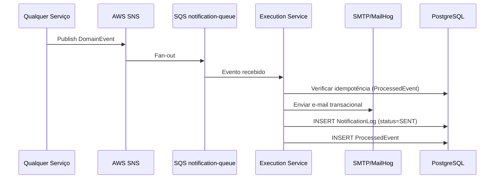

# Execution & Notification Service

> Microserviço responsável pelo rastreamento da execução dos serviços de uma ordem de serviço aprovada e pelo envio de notificações por e-mail ao cliente em cada evento relevante do ciclo de vida.

## Sumário

- [1. Visão Geral](#1-visão-geral)
- [2. Arquitetura](#2-arquitetura)
- [3. Tecnologias Utilizadas](#3-tecnologias-utilizadas)
- [4. Comunicação entre Serviços](#4-comunicação-entre-serviços)
- [5. Diagramas](#5-diagramas)
- [6. Execução e Setup](#6-execução-e-setup)
- [7. Pontos de Atenção](#7-pontos-de-atenção)
- [8. Boas Práticas e Padrões](#8-boas-práticas-e-padrões)

---

## 1. Visão Geral

### Propósito

O **Execution & Notification Service** é o microserviço responsável por dois domínios complementares:

1. **Execução**: monitora o andamento real dos serviços de uma ordem de serviço aprovada. Cada serviço da OS recebe um `ExecutionLog` individual com status próprio (`PENDING → IN_PROGRESS → COMPLETED/FAILED`). Quando todos os logs são finalizados, o serviço publica o resultado via evento assíncrono.

2. **Notificações**: escuta eventos de todo o ecossistema e envia e-mails transacionais ao cliente em cada etapa relevante do fluxo — desde a criação da OS até o pagamento, execução e entrega.

### Problema que Resolve

Em uma arquitetura de microserviços orientada a eventos, nenhum serviço tem visibilidade completa sobre o estado de execução. Este serviço centraliza:

- O controle granular de execução por serviço (não por OS como um todo)
- O disparo de notificações ao cliente de forma desacoplada dos demais serviços
- A coleta de métricas de desempenho por serviço (tempo médio, taxa de sucesso/falha)

### Papel na Arquitetura

| Papel                     | Descrição                                                                   |
| ------------------------- | --------------------------------------------------------------------------- |
| **Consumidor de eventos** | Assina filas SQS para receber eventos de aprovação, pagamento e notificação |
| **Produtor de eventos**   | Publica `ExecutionCompleted` / `ExecutionFailed` via SNS                    |
| **API REST**              | Expõe endpoints para consultar logs de execução, notificações e métricas    |
| **Notificador**           | Envia e-mails transacionais via Nodemailer (SMTP / MailHog em dev)          |

---

## 2. Arquitetura

### Clean Architecture

O serviço adota **Clean Architecture** com separação explícita de camadas:

```
src/
├── domain/           # Entidades, enums, use-case interfaces, eventos de domínio
├── application/      # Implementações dos use cases, protocolos de infraestrutura
├── infra/            # Prisma (DB), SNS/SQS (mensageria), Nodemailer (e-mail), OTel
├── presentation/     # Controllers HTTP (Fastify route adapters)
├── validation/       # Schemas Zod para validação de entrada
└── main/             # Composition root: fábricas, plugins, inicialização
```

### Decisões Arquiteturais

| Decisão                       | Justificativa                                                                            | Trade-off                                                             |
| ----------------------------- | ---------------------------------------------------------------------------------------- | --------------------------------------------------------------------- |
| **Outbox Pattern**            | Garante que eventos SNS sejam publicados mesmo se o processo falhar após persistir no DB | Latência adicional de ~5s (polling interval)                          |
| **Processamento idempotente** | Tabela `ProcessedEvent` no Prisma evita processamento duplicado de mensagens SQS         | Overhead de escrita no DB por mensagem                                |
| **Circuit Breaker**           | Protege chamadas externas (SNS, SMTP) de falhas em cascata                               | Configuração conservadora pode rejeitar chamadas legítimas em rajadas |
| **DLQ Monitor**               | Job periódico alerta sobre mensagens na Dead Letter Queue                                | Requer atenção operacional para reprocessamento manual                |

### Padrões Utilizados

- **Outbox Pattern** — eventos são persistidos no DB antes de publicados no SNS, garantindo at-least-once delivery
- **Idempotência por `eventId`** — mensagens duplicadas da SQS são detectadas e ignoradas
- **Circuit Breaker** (`src/infra/circuit-breaker.ts`) — protege SNS e SMTP
- **Repository Pattern** — interfaces de acesso a dados definidas no domínio, implementadas na camada de infra

---

## 3. Tecnologias Utilizadas

| Tecnologia        | Versão | Propósito                                        |
| ----------------- | ------ | ------------------------------------------------ |
| **Node.js**       | 22     | Runtime                                          |
| **TypeScript**    | 5.9    | Linguagem                                        |
| **Fastify**       | 5.2    | Framework HTTP — alto desempenho, schema nativo  |
| **Prisma**        | 7      | ORM — schema-first, migrações, type-safe queries |
| **PostgreSQL**    | 16     | Banco de dados relacional                        |
| **AWS SNS**       | SDK v3 | Publicação de eventos de domínio                 |
| **AWS SQS**       | SDK v3 | Consumo de eventos de outros microserviços       |
| **Nodemailer**    | 6.9    | Envio de e-mails via SMTP                        |
| **Zod**           | 4      | Validação de schemas em runtime                  |
| **OpenTelemetry** | 1.x    | Rastreamento distribuído e métricas              |
| **Jest**          | 30     | Testes unitários e de integração                 |
| **jsonwebtoken**  | 9      | Verificação de tokens JWT                        |

**Infraestrutura**: AWS (SNS, SQS), PostgreSQL (RDS em produção), EKS, ECR, Secrets Manager.

---

## 4. Comunicação entre Serviços

### Eventos Consumidos (SQS)

| Fila                         | Evento               | Ação                                         |
| ---------------------------- | -------------------- | -------------------------------------------- |
| `execution-work-order-queue` | `WorkOrderApproved`  | Cria `ExecutionLog` para cada serviço da OS  |
| `execution-work-order-queue` | `WorkOrderCanceled`  | Registra cancelamento (sem ação de execução) |
| `notification-queue`         | `WorkOrderCreated`   | Envia e-mail "OS criada"                     |
| `notification-queue`         | `WorkOrderApproved`  | Envia e-mail "OS aprovada"                   |
| `notification-queue`         | `PaymentCompleted`   | Envia e-mail "pagamento confirmado"          |
| `notification-queue`         | `PaymentFailed`      | Envia e-mail "falha no pagamento"            |
| `notification-queue`         | `ExecutionCompleted` | Envia e-mail "execução concluída"            |
| `notification-queue`         | `ExecutionFailed`    | Envia e-mail "falha na execução"             |
| `notification-queue`         | `RefundCompleted`    | Envia e-mail "estorno realizado"             |

### Eventos Publicados (SNS)

| Tópico             | Evento               | Gatilho                                 |
| ------------------ | -------------------- | --------------------------------------- |
| `execution-events` | `ExecutionCompleted` | Todos os logs marcados como `COMPLETED` |
| `execution-events` | `ExecutionFailed`    | Qualquer log marcado como `FAILED`      |

### Endpoints REST

| Método  | Rota                                    | Descrição                               | Auth    |
| ------- | --------------------------------------- | --------------------------------------- | ------- |
| `GET`   | `/api/executions/:workOrderId`          | Logs de execução de uma OS              | JWT     |
| `PATCH` | `/api/executions/logs/:id`              | Atualizar status de um log              | JWT     |
| `POST`  | `/api/executions/:workOrderId/complete` | Completar execução de uma OS            | JWT     |
| `GET`   | `/api/notifications/:workOrderId`       | Notificações enviadas para uma OS       | JWT     |
| `GET`   | `/api/metrics`                          | Métricas agregadas de todos os serviços | JWT     |
| `GET`   | `/api/metrics/:serviceId`               | Métricas de um serviço específico       | JWT     |
| `GET`   | `/health`                               | Health check                            | Público |

---

## 5. Diagramas

### Arquitetura do Serviço



### Fluxo de Execução (Sequência)



### Fluxo de Notificações



---

## 6. Execução e Setup

### Pré-requisitos

- Node.js 22+, Yarn 1.22+
- PostgreSQL 16 (ou via Docker Compose)
- AWS CLI configurado (ou MiniStack para ambiente local)
- Variáveis de ambiente configuradas (ver abaixo)

### Rodando Localmente

```bash
# Instalar dependências
yarn install

# Gerar o Prisma Client
yarn prisma:generate

# Rodar migrações
yarn prisma:migrate

# Iniciar em modo desenvolvimento (hot-reload)
yarn dev

# Build para produção
yarn build && yarn start
```

### Via Docker Compose

```bash
# Sobe o serviço + PostgreSQL local
docker compose up -d --build

# Acompanhar logs
docker compose logs -f

# Parar
docker compose down -v
```

### Variáveis de Ambiente

Copie `.env.example` para `.env` e preencha:

| Variável                             | Descrição                                   | Obrigatório            |
| ------------------------------------ | ------------------------------------------- | ---------------------- |
| `SERVER_PORT`                        | Porta HTTP do serviço                       | Sim (default: `3004`)  |
| `DATABASE_URL`                       | Connection string PostgreSQL                | Sim                    |
| `AWS_REGION`                         | Região AWS                                  | Sim                    |
| `AWS_ENDPOINT_URL`                   | Endpoint LocalStack/MiniStack (só dev)      | Não                    |
| `SNS_EXECUTION_EVENTS_TOPIC_ARN`     | ARN do tópico SNS de execução               | Sim                    |
| `SQS_EXECUTION_WORK_ORDER_QUEUE_URL` | URL da fila SQS de eventos de OS            | Sim                    |
| `SQS_NOTIFICATION_QUEUE_URL`         | URL da fila SQS de notificações             | Sim                    |
| `MAILING_ENABLED`                    | Habilitar envio de e-mails (`true`/`false`) | Não (default: `false`) |
| `SMTP_HOST` / `SMTP_PORT`            | Servidor SMTP                               | Se mailing habilitado  |
| `JWT_ACCESS_TOKEN_SECRET`            | Chave de verificação JWT                    | Sim                    |
| `OTEL_EXPORTER_OTLP_ENDPOINT`        | Endpoint do OTel Collector                  | Não                    |
| `LOG_LEVEL`                          | Nível de log (info/debug/warn/error)        | Não (default: `info`)  |

### Testes

```bash
# Unitários
yarn test

# Com cobertura
yarn test --coverage

# E2E (requer ambiente completo rodando)
yarn test:e2e
```

---

## 7. Pontos de Atenção

### Outbox Processor

O `OutboxProcessor` faz polling no banco a cada 5 segundos para publicar eventos pendentes. Se o processo reiniciar entre a persistência e a publicação, o evento será republicado na próxima execução. O consumidor destino **deve ser idempotente** (e todos são, via tabela `ProcessedEvent`).

### Idempotência Mandatória

Toda mensagem SQS carrega um `eventId` único. A tabela `ProcessedEvent` é consultada antes de qualquer processamento. Sem isso, eventos duplicados (redelivery da SQS) causariam múltiplos e-mails e logs de execução duplicados.

### DLQ (Dead Letter Queue)

Mensagens que falham 3 vezes consecutivas são movidas para a DLQ. O `DLQMonitor` alerta via log. **Mensagens na DLQ requerem atenção manual** — não há reprocessamento automático.

### E-mail Assíncrono e sem Retry

O envio de e-mail via Nodemailer é assíncrono e **sem retry automático**. Falhas de SMTP resultam em `NotificationLog` com `status=FAILED`. Monitorar via `/api/metrics` ou alertas Grafana.

### Circuit Breaker

O Circuit Breaker protege SNS e SMTP. Em modo `OPEN`, publicações e e-mails são bloqueados até recuperação. Ajuste os thresholds conforme SLA dos ambientes.

---

## 8. Boas Práticas e Padrões

### Segurança

- **JWT obrigatório** em todos os endpoints (exceto `/health`) via middleware de autenticação
- **@fastify/helmet** — headers HTTP de segurança (HSTS, CSP, etc.)
- **@fastify/rate-limit** — proteção contra abuso (rate limiting por IP)
- **@fastify/cors** — CORS configurável via `CORS_ORIGIN`
- Credenciais sempre via variáveis de ambiente — nunca hardcoded

### Validação

- Schemas **Zod** em todas as rotas de entrada, validando tipos, formatos e campos obrigatórios
- Erros de validação retornam `400` com detalhes estruturados

### Logging e Observabilidade

- Logger **Pino** (embutido no Fastify) com saída JSON estruturada
- Traces distribuídos via **OpenTelemetry** → OTLP → Prometheus → Grafana
- Métricas de negócio: `execuções_completadas`, `notificações_enviadas`, `execuções_falhadas`
- Request ID propagado em todos os logs para correlação

### Tratamento de Erros

- Handlers de erro globais do Fastify com respostas RFC 7807 (Problem Details)
- Erros de infraestrutura (DB, SNS, SMTP) são capturados, logados e não propagados para o cliente
- Circuit Breaker previne cascata de falhas

### Convenções de Código

- **Nomenclatura**: `kebab-case` para arquivos, `PascalCase` para classes/interfaces, `camelCase` para variáveis
- **Injeção de dependências**: manual via composition root em `src/main/`
- **Testes**: estrutura espelho (`*.spec.ts` ao lado do arquivo de produção)
- **Cobertura mínima**: 80% em branches, functions, lines e statements
